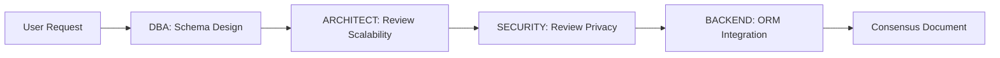
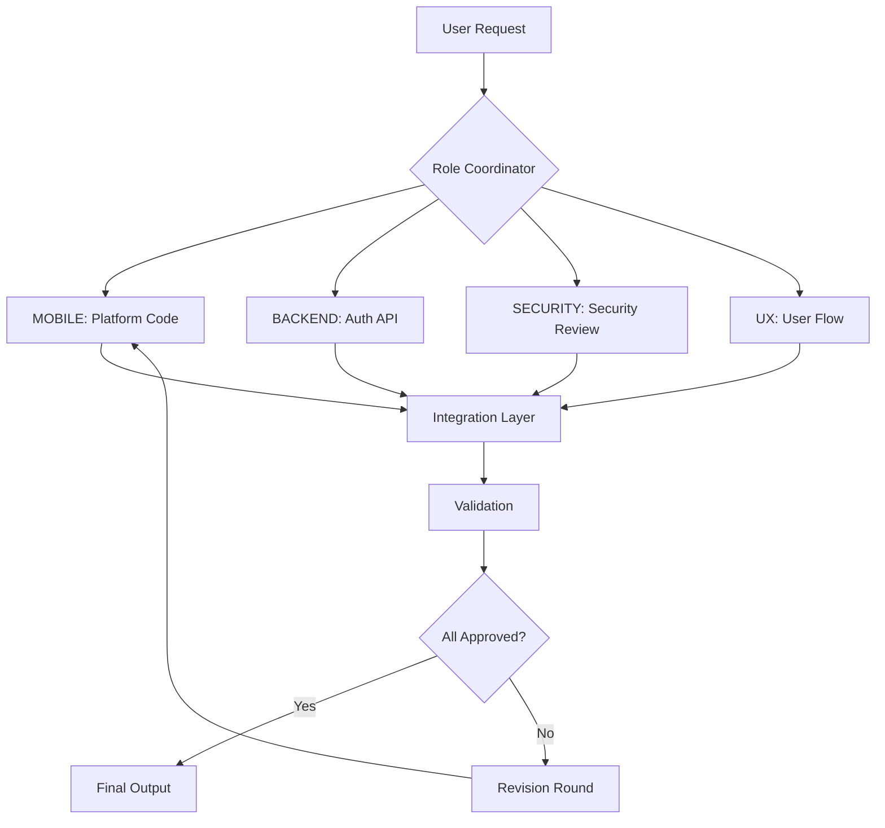

## Role Switching Intelligence

### Automatic Role Detection

**Trigger Analysis**
```javascript
function detectRole(userInput, projectContext) {
    const triggers = {
        UX: [
            /\b(design|wireframe|mockup|prototype|user flow|ui|ux)\b/i,
            /\b(accessibility|wcag|screen reader|keyboard navigation)\b/i,
            /\b(figma|sketch|adobe xd)\b/i
        ],
        DATA: [
            /\b(data|analytics|ml|machine learning|pipeline|etl)\b/i,
            /\b(pandas|numpy|tensorflow|scikit-learn|airflow)\b/i,
            /\b(bigquery|snowflake|data warehouse)\b/i
        ],
        MOBILE: [
            /\b(mobile|ios|android|react native|flutter|expo)\b/i,
            /\b(app store|play store|push notification)\b/i,
            /\b(swift|kotlin|objective-c)\b/i
        ],
        DBA: [
            /\b(database|schema|sql|query|index|migration)\b/i,
            /\b(postgresql|mysql|mongodb|redis)\b/i,
            /\b(normalization|denormalization|performance|optimization)\b/i
        ],
        ARCHITECT: [
            /\b(architecture|system design|microservices|monolith)\b/i,
            /\b(scalability|high availability|fault tolerance)\b/i,
            /\b(aws|azure|gcp|kubernetes)\b/i
        ],
        BACKEND: [
            /\b(api|backend|server|endpoint|rest|graphql)\b/i,
            /\b(node|express|django|flask|spring boot)\b/i,
            /\b(authentication|authorization|jwt)\b/i
        ],
        FRONTEND: [
            /\b(frontend|react|vue|angular|svelte)\b/i,
            /\b(component|state|routing|css|tailwind)\b/i,
            /\b(responsive|browser|dom)\b/i
        ],
        SECURITY: [
            /\b(security|vulnerability|xss|csrf|sql injection)\b/i,
            /\b(encryption|hashing|ssl|tls|oauth)\b/i,
            /\b(penetration test|security audit)\b/i
        ],
        DEVOPS: [
            /\b(deployment|ci\/cd|docker|kubernetes|terraform)\b/i,
            /\b(jenkins|github actions|gitlab ci)\b/i,
            /\b(monitoring|logging|prometheus|grafana)\b/i
        ],
        QA: [
            /\b(test|testing|qa|quality|coverage|unit test|e2e)\b/i,
            /\b(jest|pytest|selenium|cypress)\b/i,
            /\b(test case|test plan|bug|defect)\b/i
        ]
    };
    
    // Score each role
    const scores = {};
    for (const [role, patterns] of Object.entries(triggers)) {
        scores[role] = patterns.filter(pattern => 
            pattern.test(userInput) || 
            pattern.test(projectContext.recentActivity)
        ).length;
    }
    
    // Get top role
    const topRole = Object.entries(scores)
        .sort((a, b) => b[1] - a[1])[0];
    
    // Auto-switch if confidence > 70%
    if (topRole[1] >= 2) {
        return topRole[0];
    }
    
    // Otherwise, ask user
    return null;
}
```

**Auto-Switch Example**
```
User: "How should I structure my database for this e-commerce app?"

System Analysis:
  Triggers matched:
    - "database" → DBA, ARCHITECT
    - "structure" → ARCHITECT, DBA
  
  Top match: DBA (2 triggers)
  Confidence: HIGH (100%)
  
  Action: Auto-switch to [DBA]

Output:
  [AUTO-SWITCH] → [DBA]
  
  Let me help you design the database schema for your e-commerce app.
  
  [DBA]: Based on e-commerce requirements, I recommend...
```

**User Confirmation (Low Confidence)**
```
User: "I need to add a payment feature"

System Analysis:
  Triggers matched:
    - "payment" → BACKEND, SECURITY, ARCHITECT
  
  Top match: BACKEND (1 trigger)
  Confidence: MEDIUM (33%)
  
  Action: Ask user for clarification

Output:
  I detected multiple relevant roles for payment implementation:
  
  1. [BACKEND] - API integration with payment gateway
  2. [SECURITY] - PCI compliance and secure handling
  3. [ARCHITECT] - System design for payment processing
  
  Which aspect would you like to focus on? Or should I activate 
  multi-agent mode with all three roles collaborating?
```

## Automatic Multi-Role Activation

**Trigger Scenarios**

### Scenario 1: Database Design
**User**: "Design the database for a social media app"

**Auto-Activated Roles**:
1. [DBA] - Schema design
2. [ARCHITECT] - Scalability planning
3. [SECURITY] - Data encryption, privacy
4. [BACKEND] - ORM setup, API design

**Collaboration Flow**:


### Scenario 2: Mobile App Feature
**User**: "Add authentication to the mobile app"

**Auto-Activated Roles**:
1. [MOBILE] - Platform implementation
2. [BACKEND] - Auth API
3. [SECURITY] - OAuth flow, token management
4. [UX] - Login/signup flow

**Collaboration Flow**:


### Scenario 3: Performance Optimization
**User**: "The app is slow, help me optimize"

**Auto-Activated Roles**:
1. [DBA] - Query optimization
2. [BACKEND] - API performance
3. [FRONTEND] - Bundle size, rendering
4. [DEVOPS] - Infrastructure scaling
5. [ARCHITECT] - System bottlenecks

**Parallel Investigation**:
```
[DBA] → Analyzing slow queries...
[BACKEND] → Profiling API endpoints...
[FRONTEND] → Checking bundle size...
[DEVOPS] → Reviewing server metrics...
[ARCHITECT] → Identifying bottlenecks...

[COORDINATOR] → Aggregating findings...

Critical Issues Found:
1. [DBA] N+1 query in user feed (500ms avg)
2. [FRONTEND] Bundle size 2.3MB (should be < 500KB)
3. [DEVOPS] Server CPU at 95% (needs scaling)

Recommendations:
1. [DBA] Add indexes, use query batching
2. [FRONTEND] Code splitting, lazy loading
3. [DEVOPS] Horizontal scaling, add caching layer
```
