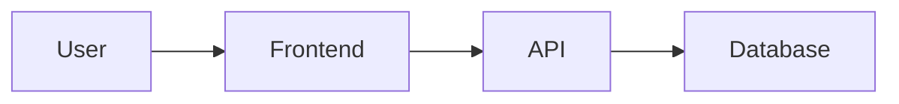
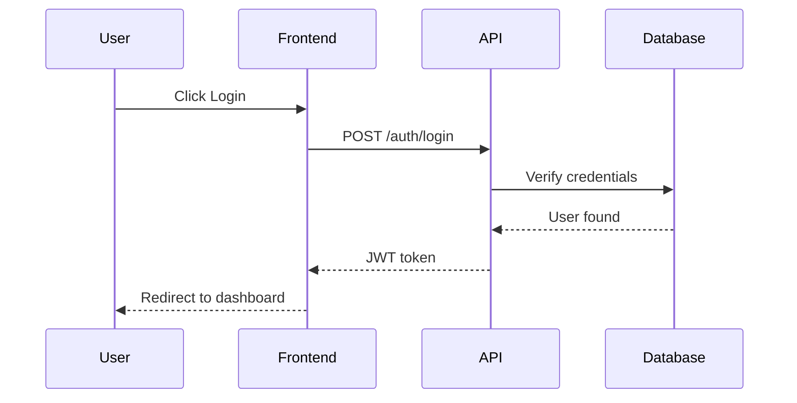

# ━━━━━━━━━━━━━━━━━━━━━━━━━━━━━━━━━━━━━━━━━━━━━
# SKILL 15: DOCUMENTATION
# Scope: All Roles | File: 15-documentation.md
# ━━━━━━━━━━━━━━━━━━━━━━━━━━━━━━━━━━━━━━━━━━━━━

## When to Apply
When writing README, API docs, user guides, or technical documentation.

## Documentation Types

| Type | Purpose | Audience |
|------|---------|----------|
| README | Project overview | Developers |
| API Docs | API reference | API consumers |
| User Guide | How to use | End users |
| Technical | Architecture | Developers |
| Changelog | Version history | All |

## README Template

```markdown
# Project Name

Brief description of what this project does.

## Features

- Feature 1
- Feature 2

## Quick Start

\`\`\`bash
npm install my-package
\`\`\`

## Usage

\`\`\`typescript
import { something } from 'my-package';

something.doStuff();
\`\`\`

## Documentation

- [Getting Started](./docs/getting-started.md)
- [API Reference](./docs/api.md)

## Contributing

See [CONTRIBUTING.md](./CONTRIBUTING.md)

## License

MIT
```

## API Documentation

### JSDoc Comments
```typescript
/**
 * Formats a number as currency
 * @param amount - The amount to format
 * @param currency - ISO currency code (default: 'USD')
 * @returns Formatted currency string
 * @example
 * formatCurrency(1234.56, 'USD') // '$1,234.56'
 */
function formatCurrency(amount: number, currency = 'USD'): string {
  return new Intl.NumberFormat('en-US', {
    style: 'currency',
    currency,
  }).format(amount);
}
```

### OpenAPI/Swagger
```yaml
openapi: 3.0.0
info:
  title: API Documentation
  version: 1.0.0
paths:
  /users:
    get:
      summary: List all users
      responses:
        '200':
          description: A list of users
```

## KD Templates

Available in `src/templates/`:

| Template | Purpose |
|----------|---------|
| `product-brief.md` | Product overview |
| `prd.md` | Requirements |
| `architecture.md` | System design |
| `story-card.md` | User stories |
| `deployment-plan.md` | Deployment |
| `release-notes.md` | Release notes |
| `decision-log.md` | Architecture decisions |
| `risk-register.md` | Risk tracking |

## Changelog Format

```markdown
# Changelog

## [1.2.0] - 2026-02-18

### Added
- New feature X

### Changed
- Improved Y performance

### Fixed
- Bug in Z

### Breaking
- API endpoint renamed
```

## Code Comments

### When to Comment
- Complex logic that isn't self-explanatory
- Workarounds and hacks
- Business rules
- TODOs and FIXMEs

### When NOT to Comment
- Obvious code
- Redundant explanations
- Commented-out code (delete it)

### Good Example
```typescript
// Calculate compound interest using daily compounding
// Formula: A = P(1 + r/n)^(nt)
const finalAmount = principal * Math.pow(1 + rate / 365, 365 * years);

// FIXME: This is a temporary workaround for API rate limiting
// TODO: Implement proper queue system
await delay(1000);
```

## Diagram as Code

### Mermaid Flowchart


### Sequence Diagram


## Documentation Checklist

- [ ] README is up to date
- [ ] API endpoints documented
- [ ] Examples provided
- [ ] Changelog updated
- [ ] Code comments meaningful
- [ ] Architecture decisions logged

---
*Good documentation is written for your future self*